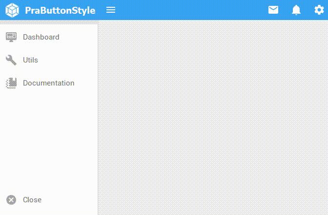

<h1 align="center">
 
  PraButtonStyle
 
</h1>

Button with very attractive layout, standard bootstrap 

  

## Features
[//]: # (Add the features of your project here:)

- **Delphi-VCL** — Tested on the latest delphi.

## Getting started

Add the folder **source directory to the Library path in Delphi inside the Tools->Options menu. 
The Options window will show up and there you have to click on Environment Options->Delphi Options->Library, select the right platform (32 or 64 bits) and add directory in Library path.

## License

This project is licensed under the MIT License - see the [LICENSE](https://opensource.org/licenses/MIT) page for details.
