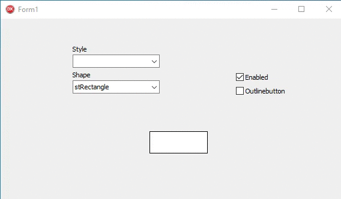
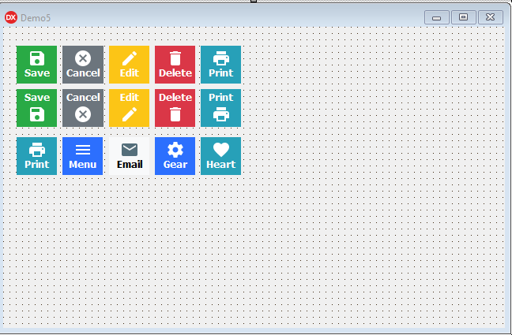

<h1 align="center">
 
  PraButtonStyle in (Delphi, Lazarus)
 
</h1>

Button with very attractive layout, standard bootstrap to Delphi/Lazarus VCL 

  

  

  

  

  

  

## Features

- **Delphi-VCL** — Tested on the latest delphi.
- **Lazarus-VCL** — preparing and converting to lazarus. compiled delphi; developing lazarus.

## Documentation

**Brush:** Fill the Button color.

**BrushDown:** Fill the button color by pressing.

**BrushFocused:** Fill in the button color when entering the mouse or receiving focus.

**BrushDisabled:** Fill in the button color when disabled.

**Font:** Specifies the source;

**FontDown:** Specifies the source when pressing;

**FontFocused:** Specifies the font when entering with the mouse or receiving focus;

**FontDisabled:** Specifies the source when it is disabled;

**Pen:** Fill the border color.

**PenDown:** Fill the border color when pressed.

**PenFocused:** Fills the border color when entering with mouse or when receiving focus.

**PenDisabled:** Fills the border color when disabled.

**Picture:** Specifies the image that appears on the image control;

**PictureFocused:** Specifies the image that appears when entering the mouse or receiving focus;

**PictureDisabled:** Specifies the image that will appear when disabled;

**PictureMarginLeft:** Specifies the image margin in relation to the left;

**Radius:** Specifies how much corners should be rounded;

**Spacing:** Specifies the space between the picture and caption;

**ClickOnEnter:** Performs the click when pressing enter;

**Style:** Select standard bootstrap ready styles.

**StyleOutline:** Inverts colors, used when selecting ready styles.

**TemplateStyle:** Templates pre-configured

**PictureLayout:** Use To Change Position Picture no button

## Getting started

Add the folder 

**Delphi-PraButtonStyle\source**

**Delphi-PraButtonStyle\source\commom** 

directory to the Library path in Delphi inside the Tools->Options menu. 
The Options window will show up and there you have to click on Environment Options->Delphi Options->Library, select the right platform (32 or 64 bits) and add directory in Library path.

## License

This project is licensed under the MIT License - see the [LICENSE](https://opensource.org/licenses/MIT) page for details.
