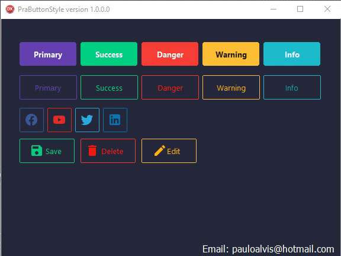

# Delphi-PraButtonStyle

**Installation:**
  Add the folder source directory to the Library path in Delphi inside the Tools->Options menu. 
The Options window will show up and there you have to click on Environment Options->Delphi Options->Library, select the right platform (32 or 64 bits) and add directory in Library path.
